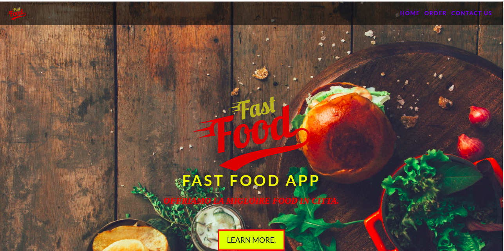

## Kitchen App

#### Description

<table>
<tr>
<td>
This is an app that enables students and staff at Moringa School to order food from the kitchen and have it delivered to their classes or offices, or be ready for pick-up.
</td>
</tr>
</table>

#### Authors

By [Collin Owino](https://github.com/Collin9726), [Fadhili Muturi](https://github.com/Fadhili01), [Jerry Nabango](https://github.com/jerrynabango), [Christine Mugambi](https://github.com/Christine752) and [Ryan Rotich](https://github.com/RYAN2540).

#### Latest updated version is on Thursday, 23rd April 2020.

### Problem statement

Lunch time is short and with busy schedules makes it even shorter. It becomes a hustle to get food, considering the movement from the person's current location to the food joint, getting the food and eventually back to your workspace.

### Solution

Hence, our project aims to make the process faster, easier and more efficient, and generally time-saving.
\*Check out the project through <a href="https://christine752.github.io/Kitchen-App/">This Link.</a>

### Technologies used

1. HTML
2. CSS
3. Bootstrap
4. Javascript
5. Jquery

### Development

To contribute to this project on any modules, follow these easy steps:

- Fork the repo
- Create a new branch in your terminal (git checkout -b improve-feature)
- Make appropriate changes in file(s)
- Add the changes and commit them (git commit -am "Improve App")
- Push to the branch (git push origin improve-app)
- Create a Pull request

### Contact details

For any queries, issues, ideas or concerns, contact any of the authors below:

- [Collin Owino](owino.collin@gmail.com)
- [Fadhili Muturi](fadhoturi01@gmail.com)
- [Jerry Nabango](jerrynabango9@gmail.com)
- [Ryan Rotich](austinbrian005@gmail.com)
- [Christine Mugambi](njeri.mugamby@gmail.com)

### License

MIT license
Copyright (c) 2020 Team Users
